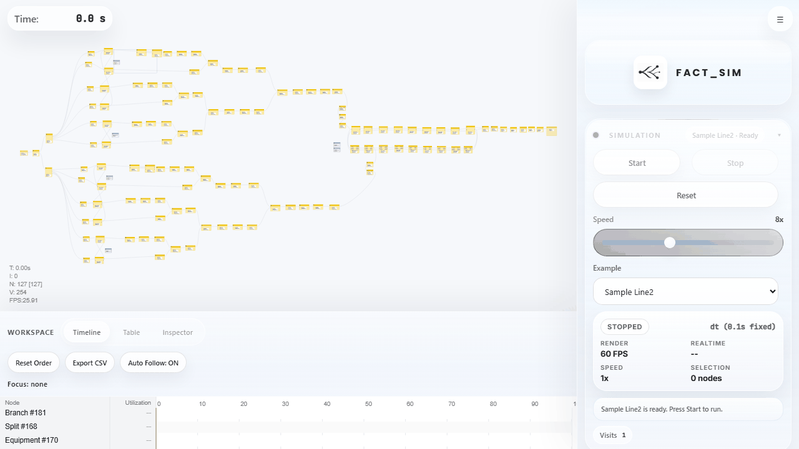
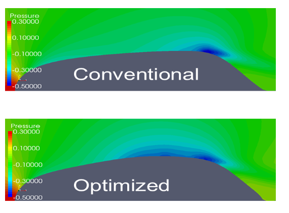
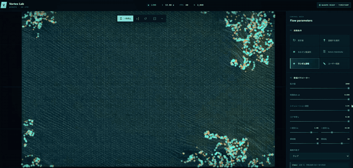

# FactSim | AI × Factory × Simulation

Production engineer building **FactSim**, a browser-based discrete-event simulator grounded in real manufacturing experience.

## Main Project — FactSim

**Model production lines, logistics, and workflows. Understand throughput, waiting, and bottlenecks before changing the real system.**

  

**[Try FactSim in your browser](https://suzuking001.github.io/fact_sim/)** · **[Source code](https://github.com/suzuking001/fact_sim)** · [Japanese quick reference](https://github.com/suzuking001/fact_sim/blob/main/docs/quick-reference-ja.md)

FactSim is an **open-source, general-purpose discrete-event simulator** that runs entirely in the browser. Manufacturing is its main application, with models for equipment, buffers, AGVs, carriers, pallets, and stations. The same approach also supports warehouse operations, internal transport, and resource-constrained workflows.

### What you can do

- **Build models visually:** connect nodes to describe processing, queues, branching, merging, and transport.
- **Evaluate capacity:** study throughput, takt time, bottlenecks, equipment counts, and buffer sizes.
- **Inspect system behavior:** use timing charts, node highlighting, and CSV export to explain waiting, blocking, and state transitions.
- **Compare scenarios:** change processing times, routing, downtime, or transport capacity and inspect their effects.
- **Save and share:** load/save JSON models and share scenarios through URLs.
- **Work with AI agents:** the integrated [MCP server](https://github.com/suzuking001/fact_sim/tree/main/mcp) supports model editing, simulation control, KPI reports, and optimization workflows.

### Start with a sample

1. Open the **[live demo](https://suzuking001.github.io/fact_sim/)**.
2. Select `Sample Line2`, `Sample Line1`, or `Carrier Config Example`.
3. Click `Start`, then inspect `Timing Chart`.
4. Export CSV to support your engineering review.

### Engineering questions behind FactSim

- Will the line meet takt time, and what throughput can it achieve?
- Where does work wait, accumulate, or become blocked?
- How many machines, AGVs, or carriers are required?
- How much buffer capacity is needed?
- How do routing and resource constraints affect the result?

My goal is to make simulation **practical, transparent, and explainable**, so engineers can connect system behavior to concrete design decisions.

---

## About Me

I work as a **production engineer at an automotive manufacturer**, with experience in:

- New vehicle production launch
- Manufacturing system development
- Production equipment engineering
- Factory automation

My mechanical engineering background and experience developing simulation code led me to build FactSim around the questions engineers face in real factories.

I studied **fluid simulation at Yokohama National University** (Graduate School of Systems Integration Engineering, Master's degree), where I developed custom fluid analysis codes.

Graduate research — fluid simulation and shape optimization

  

Graduate research: fairing shape optimization using fluid simulation and genetic algorithms.

---

## Other Simulation Projects

### Vortex Lab

An **interactive WebGPU simulation** for exploring flow fields and particle behavior in real time. Switch between flow patterns and tune parameters to observe vortices and passive tracers.

[Source code](https://github.com/suzuking001/uzuhou_web)

View the Vortex Lab demo

  

---

## Public Open Data Apps

I also build civic-tech web applications using local government open data.

Some of my web apps have been listed as public open data use cases by Japanese public organizations:

- **Digital Agency, Government of Japan**  
  Hamamatsu City Event Map  
  https://www.digital.go.jp/resources/data_case_study_local

- **Hamamatsu City**  
  Childcare facility status map apps  
  https://www.city.hamamatsu.shizuoka.jp/koho2/opendata/jirei.html

- **Shizuoka Prefecture Open Data**  
  Hamamatsu City Event Map  
  https://opendata.pref.shizuoka.jp/agreement.html

Related apps:

- Hamamatsu City Event Map  
  https://suzuking001.github.io/event_map/

- Childcare temporary availability map  
  https://suzuking001.github.io/kodomo_map/

- Childcare application demand map  
  https://suzuking001.github.io/bosyu_map/

- Universal childcare program facility map  
  https://suzuking001.github.io/daredemo_map/

---

## Current Focus

- FactSim and general-purpose discrete-event modeling
- Manufacturing systems and internal logistics
- Explainable throughput and bottleneck analysis
- Simulation × AI and optimization workflows

---

## Technologies

- **Simulation:** Discrete Event Simulation, System Modeling
- **Programming:** JavaScript, Python
- **Engineering:** Manufacturing Engineering, Production Systems, Industrial Automation

---

## Vision

Build practical factory engineering tools that make system behavior understandable and help engineers evaluate changes with clear evidence.

---

## Links

- **[FactSim — live demo](https://suzuking001.github.io/fact_sim/)**
- **[FactSim — GitHub](https://github.com/suzuking001/fact_sim)**
- [GitHub profile](https://github.com/suzuking001)
